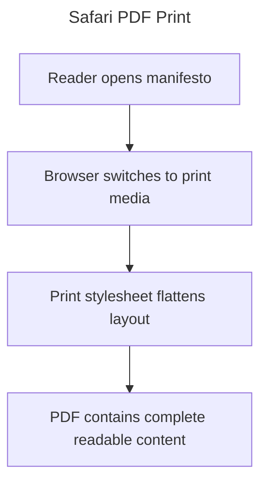

# Instruction: Stabilize Print Rendering

Part of [`plan.md`](./plan.md).

## Architecture projection

```txt
.
├── app/
│   ├── src/styles/sections/print.css 🔁
│   └── tests/e2e/print.spec.ts ✅
└── aidd_docs/tasks/2026_06/2026_06_30_safari_pdf_print/
    ├── spec.md ✅
    ├── plan.md ✅
    └── phase-1.md ✅
```

## User Journey



## Wireframe

```txt
┌─────────────────────────────────────┐
│ (1) Cover                           │
├─────────────────────────────────────┤
│ (2) Definition                      │
├─────────────────────────────────────┤
│ (3) Values                          │
├─────────────────────────────────────┤
│ (4) Principles                      │
├─────────────────────────────────────┤
│ (5) Signatures + footer             │
└─────────────────────────────────────┘
```

1. Cover: printed as a document title page.
2. Definition: dictionary and comparison content visible in normal flow.
3. Values: every value row and supporting visual content visible.
4. Principles: every commitment visible without hover, reveal, or scroll state.
5. Signatures + footer: signatory wall and document footer included.

## Tasks to do

### `1)` Print stylesheet

> Make print media use a paged document flow instead of the interactive screen layout.

1. Reset clipped overflow, sticky/fixed positioning, transforms, animations, transitions, and reveal opacity under `@media print`.
2. Flatten the document layout to one column and remove sidebar/interactivity from the printable output.
3. Add current section classes to print-specific spacing, borders, and page-break behavior.
4. Keep visual content visible while preventing large blocks from being clipped or hidden.

### `2)` Print test

> Prove representative content survives print-media rendering.

1. Add a Playwright test that emulates `print` media.
2. Assert major page sections are visible.
3. Assert representative definition, value, principle, signature, and footer text exists in the rendered print document.

## Test acceptance criteria

| Task | Acceptance criteria |
| ---- | ------------------- |
| 1 | Print CSS includes `Definition`, `Values`, `Principles`, `Signature`, and footer in normal paged flow with screen-only UI hidden. |
| 1 | Reveal and animated content is force-visible in print media. |
| 2 | `npx playwright test tests/e2e/print.spec.ts` passes. |
| 2 | `npm run build` passes. |
