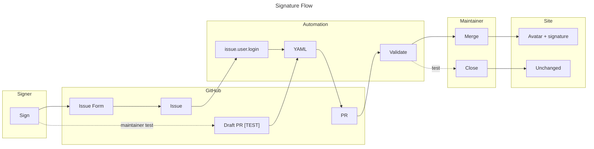

# Signatory file format

Most signers should use the GitHub signature form linked from the manifesto
site. The form uses the GitHub account that submits the issue as the public
`github` handle, then automation opens a pull request with the YAML file below.



Each signatory has one YAML file in this directory, named after their GitHub
handle: `{handle}.yml`. The handle must match the `github` field inside the
file. Filename collisions are impossible because GitHub handles are unique.

## Required fields

- `github` — GitHub handle, e.g. `alexsoyes`. Used to fetch the avatar
  (`https://github.com/{handle}.png`) and link to the profile.
- `name` — Display name, e.g. `Alexandre Soyer`.

> There is **no** `signed_on` field. The signature date is derived from the git
> commit that added your file (committer date), so it cannot be backdated.
> See `app/scripts/gen-signature-dates.mjs`.

## Optional fields

- `linkedin` — Full LinkedIn profile URL.
- `affiliation` — Title or company, max 120 chars.
- `statement` — One-line public statement, max 280 chars.

## Example

```yaml
github: alexsoyes
name: Alexandre Soyer
linkedin: https://www.linkedin.com/in/alexandre-soyer/
affiliation: AI-Driven Dev
statement: >
  This is how I already build software with AI, and how I
  want the trade to mature.
```

## Validation

YAML files are validated at build time by Astro Content Collections (Zod
schema in `app/src/content.config.ts`). A malformed file will fail the
build, so the `Validate` GitHub Action on each pull request catches errors
before merge.

## Maintainer test mode

For an end-to-end test that must not publish a signature, run the `Signature PR`
workflow manually with `workflow_dispatch`. Automation must create a draft PR
titled `[TEST] ...`; verify that validation can run, then close the PR without
merging and delete the test branch.
